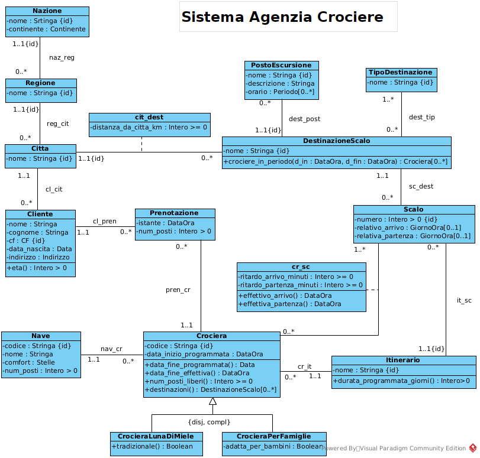
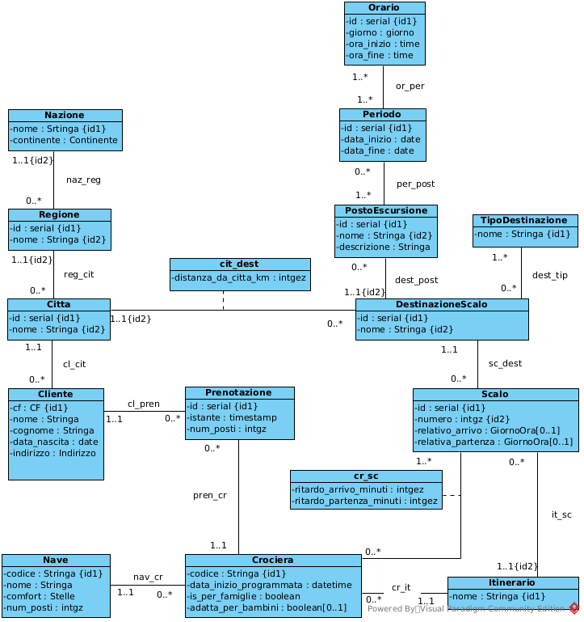

# Cruise Agency Information System

Database design project for the management of a cruise travel agency.

---

# Sistema Agenzia Crociere

## Panoramica

Questo progetto rappresenta la **progettazione di un sistema informativo per la gestione di una agenzia turistica che organizza crociere**.

Il sistema permette di gestire:

- crociere offerte dall’agenzia  
- itinerari e destinazioni  
- navi utilizzate per le crociere  
- clienti e prenotazioni  
- attività e luoghi visitabili durante le escursioni  

Il progetto è stato sviluppato partendo dalla **specifica dei requisiti**, passando per la **modellazione UML**, fino alla **traduzione in schema relazionale SQL**.

---

# Processo di progettazione

Il sistema è stato progettato seguendo le principali fasi della progettazione di basi di dati.

## 1. Analisi dei requisiti

Studio del problema e identificazione delle principali entità del sistema.

Il testo originale della specifica è disponibile nel file:

`problem_description.md`

Le principali entità individuate sono:

- Crociera  
- Nave  
- Cliente  
- Prenotazione  
- Itinerario  
- Scalo  
- Destinazione  
- PostoEscursione  

Sono state inoltre definite le funzionalità richieste dal sistema, come la gestione delle prenotazioni e il calcolo di statistiche.

---

## 2. Modellazione concettuale

Il dominio del problema è stato modellato tramite un **diagramma UML delle classi** che rappresenta:

- entità del dominio
- attributi
- associazioni tra le classi
- vincoli del sistema

### Diagramma UML concettuale



---

## 3. Ristrutturazione per basi di dati

Il modello concettuale è stato ristrutturato per la progettazione della base di dati.

Le principali attività svolte sono:

- ristrutturazione del diagramma UML
- definizione dei vincoli di integrità
- introduzione degli identificatori
- adattamento del modello alla traduzione relazionale

### Diagramma UML ristrutturato



---

## 4. Traduzione in schema relazionale

Il modello finale è stato trasformato in **schema relazionale SQL**.

Lo schema include:

- definizione delle tabelle
- chiavi primarie
- chiavi esterne
- domini e tipi personalizzati
- vincoli di integrità

File principale:

`database_schema.sql`

---

# Dataset di esempio

Il repository include anche un file SQL con **dati di esempio** per popolare il database e testare il sistema.

File:

`dati.sql`

Questo file contiene:

- nazioni, regioni e città
- clienti
- navi
- itinerari e destinazioni
- luoghi visitabili durante le escursioni
- scalI delle crociere
- crociere pianificate
- prenotazioni effettuate dai clienti

I dati sono utili per:

- testare lo schema del database
- simulare prenotazioni
- verificare le query statistiche richieste dal sistema.

---

# Funzionalità principali

Il sistema supporta diverse operazioni, tra cui:

- prenotazione di posti su una crociera
- gestione delle destinazioni e delle escursioni
- calcolo dell’età media dei clienti che prenotano crociere con destinazioni esotiche
- calcolo della percentuale di destinazioni più richieste in un certo periodo

---

# Struttura del repository
```text
Sistema_Agenzia_Crociere
│
├── README.md
├── problem_description.md
├── functional_specifications.pdf
│
├── database_schema.sql
├── sample_data.sql
│
├── uml_class_diagram.png
└── uml_restructured_for_database.png
```


---

# Tecnologie e concetti utilizzati

Questo progetto utilizza principalmente concetti di:

- modellazione UML
- progettazione concettuale
- ristrutturazione per basi di dati
- progettazione di basi di dati relazionali
- SQL

---

# Contesto del progetto

Progetto sviluppato come esercizio accademico nell’ambito dello studio di **progettazione di sistemi informativi e basi di dati**.

