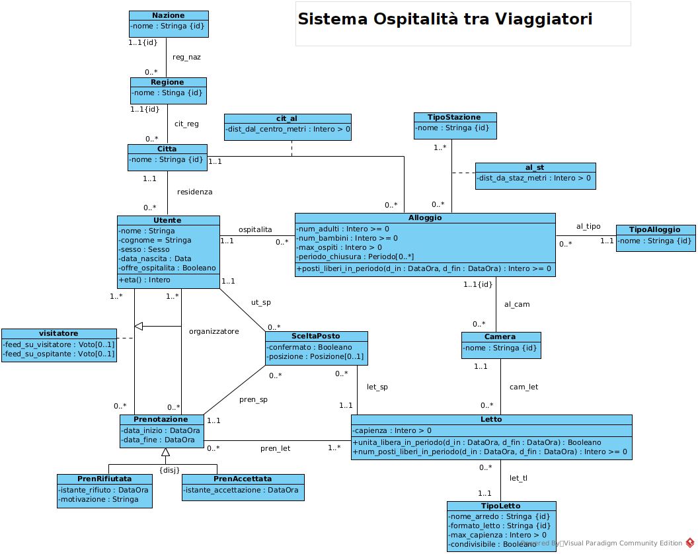
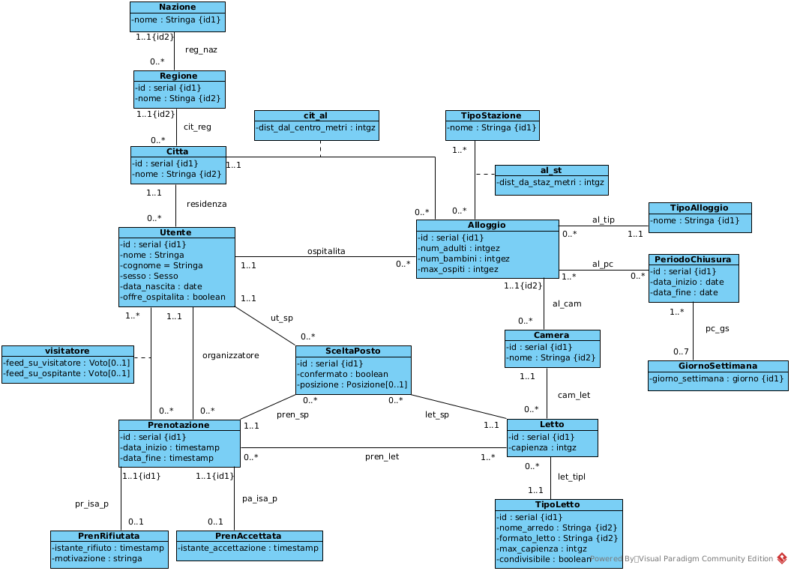

# Hospitality Platform for Travelers

Database design project for a platform that allows travelers to request hospitality from other users, inspired by services similar to Couchsurfing.

---

# Sistema Ospitalità tra Viaggiatori

## Panoramica

Questo progetto rappresenta la progettazione di un **sistema informativo per una piattaforma web di ospitalità tra viaggiatori**, simile a servizi come Couchsurfing.

Il sistema consente agli utenti registrati di offrire ospitalità nella propria abitazione e ai viaggiatori di cercare alloggi disponibili durante i loro viaggi.

La piattaforma permette di:

- registrare utenti e profili personali
- pubblicare alloggi disponibili
- cercare ospitanti in una città e in un determinato periodo
- gestire richieste di prenotazione
- valutare ospitanti e viaggiatori tramite un sistema di feedback

L'obiettivo del progetto è **modellare il dominio del problema e progettare una base di dati relazionale coerente e ben strutturata**.

La descrizione originale del problema è disponibile nel file:

`problem_description.md`

---

# Processo di progettazione

Il progetto segue le principali fasi della progettazione di basi di dati.

## 1. Analisi dei requisiti

Studio della specifica testuale del problema e identificazione delle entità e delle operazioni del sistema.

Il sistema deve permettere agli utenti di:

- offrire ospitalità nella propria abitazione
- cercare ospitanti disponibili
- effettuare richieste di prenotazione
- gestire disponibilità e periodi di chiusura
- lasciare feedback dopo il soggiorno

La descrizione completa del problema è disponibile nel file:

`problem_description.md`

---

## 2. Modellazione concettuale

Il dominio è stato modellato tramite **diagrammi UML delle classi**.

Il diagramma rappresenta:

- entità del sistema
- attributi
- relazioni tra le entità
- vincoli del dominio

### Diagramma UML concettuale



---

## 3. Ristrutturazione per basi di dati

Il modello concettuale è stato ristrutturato per adattarlo alla progettazione di una base di dati relazionale.

Questa fase include:

- introduzione di identificatori
- riorganizzazione delle associazioni
- adattamento del modello alla traduzione relazionale

### Diagramma UML ristrutturato



---

## 4. Traduzione in schema relazionale

Il modello finale è stato tradotto in **schema relazionale SQL**.

Lo schema definisce:

- tabelle
- chiavi primarie
- chiavi esterne
- vincoli di integrità

File principale:

`database_schema.sql`

---

# Modello dei dati

Le principali entità del sistema sono:

**Utente**  
Persona registrata alla piattaforma.

**Alloggio**  
Abitazione offerta per ospitalità da un utente.

**Camera**  
Stanza dell’alloggio.

**Letto**  
Unità prenotabile all’interno di una camera.

**Prenotazione**  
Richiesta di soggiorno effettuata da un viaggiatore.

**SceltaPosto**  
Associazione tra prenotazione e posti letto scelti.

Il sistema include inoltre entità per gestire la disponibilità degli alloggi:

- **PeriodoChiusura** – periodi programmati di indisponibilità
- **ChiusuraStraordinaria** – chiusure temporanee dovute a imprevisti

---

# Funzionalità principali

Il sistema supporta diverse funzionalità.

## Registrazione utenti

Gli utenti possono registrarsi al portale fornendo informazioni personali.

## Gestione alloggi

Gli ospitanti possono:

- registrare un alloggio
- definire camere e posti letto
- specificare il numero massimo di ospiti
- indicare periodi di chiusura o indisponibilità

## Ricerca alloggi

I viaggiatori possono cercare ospitanti disponibili:

- in una specifica città
- in un determinato periodo
- con posti sufficienti disponibili

## Gestione prenotazioni

I viaggiatori possono inviare richieste di prenotazione che l’ospitante può:

- accettare
- rifiutare indicando una motivazione

## Sistema di feedback

Dopo il soggiorno:

- il viaggiatore deve valutare l’ospitante
- l’ospitante può valutare il viaggiatore

Questo meccanismo migliora l'affidabilità e la sicurezza della piattaforma.

---

# Struttura del repository
```text
Sistema_Ospitalita_Tra_Viaggiatori
│
├── README.md
├── problem_description.md
├── functional_specifications.pdf
│
├── database_schema.sql
│
├── uml_class_diagram.png
└── uml_restructured_for_database.png
```


---

# Tecnologie e concetti utilizzati

Questo progetto utilizza principalmente concetti di:

- modellazione UML
- progettazione concettuale
- ristrutturazione per basi di dati
- progettazione di basi di dati relazionali
- SQL

---

# Contesto del progetto

Progetto sviluppato come esercizio accademico nell’ambito dello studio di **progettazione di sistemi informativi e basi di dati**.
