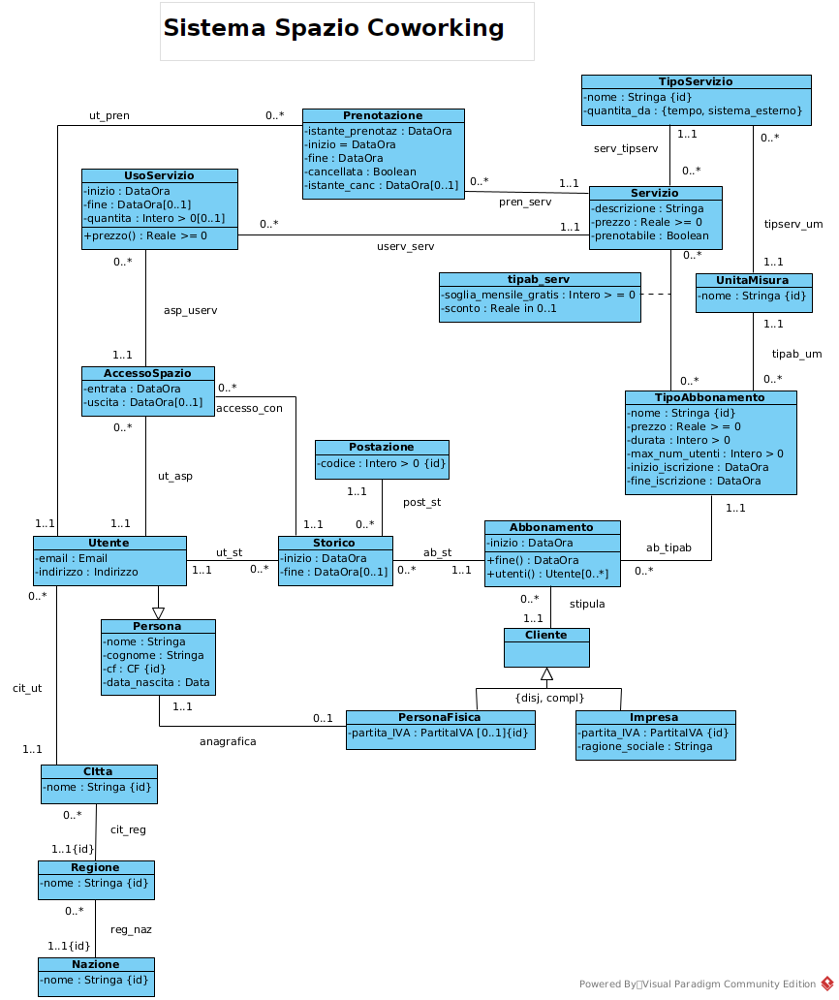
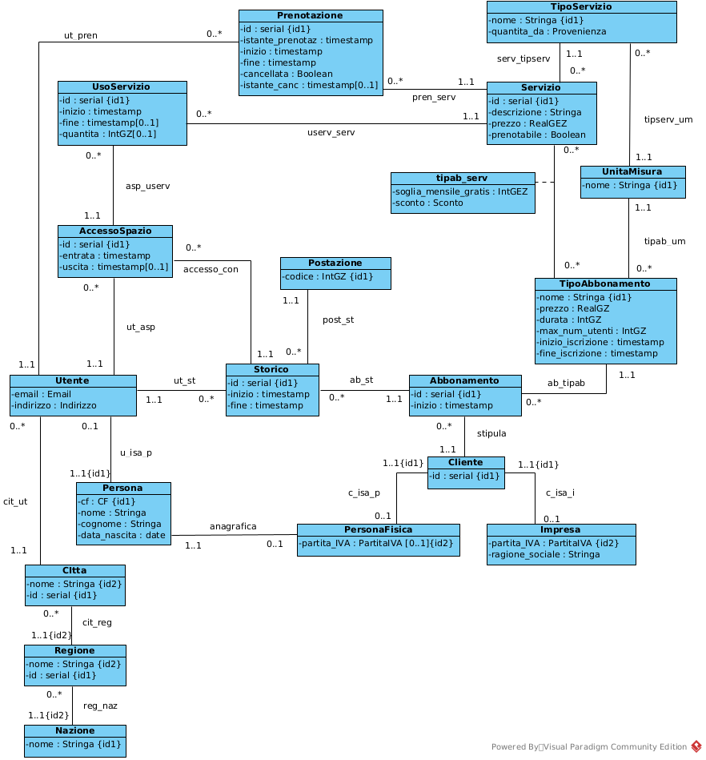

# Coworking Space Management System

Database design project for the management of a coworking space.

---

# Sistema Spazio Coworking

## Panoramica

Questo progetto rappresenta la **progettazione di un sistema informativo** per la gestione di uno spazio di coworking.

Il sistema permette di gestire:

- clienti e utenti dello spazio
- abbonamenti e tipologie di tariffa
- servizi disponibili (sale riunioni, attrezzature, ecc.)
- accessi allo spazio di lavoro
- utilizzo dei servizi e relativi costi

L'obiettivo del progetto è **modellare il dominio del problema e progettare una base di dati relazionale coerente** per la gestione delle attività di uno spazio di coworking.

---

# Processo di progettazione

Il progetto segue le principali fasi di progettazione di un sistema informativo e di una base di dati.

## 1. Analisi dei requisiti

Definizione del problema e delle funzionalità richieste dal sistema.

Il testo originale utilizzato come punto di partenza per il progetto è disponibile nel file:

`problem_description.md`

---

## 2. Modellazione concettuale

Il dominio del problema è stato modellato tramite un **diagramma UML delle classi**, che rappresenta le principali entità del sistema, le relazioni tra di esse e alcuni vincoli.



---

## 3. Ristrutturazione per basi di dati

Il modello concettuale è stato successivamente **ristrutturato per la progettazione della base di dati**, introducendo identificatori e adattando il modello alla futura implementazione relazionale.



---

## 4. Schema relazionale

Il modello finale è stato tradotto in **schema relazionale**, implementato nel file:

`database_schema.sql`

---

# Modello dei dati

Il modello dati include le principali entità del sistema:

| Entità | Descrizione |
|------|-------------|
| **Utente** | Persona che utilizza lo spazio di coworking |
| **Cliente** | Soggetto che sottoscrive un abbonamento (persona fisica o impresa) |
| **Abbonamento** | Contratto che consente l’accesso allo spazio |
| **TipoAbbonamento** | Definisce durata, prezzo e numero massimo di utenti |
| **Postazione** | Postazione di lavoro assegnata a un utente |
| **Servizio** | Servizi disponibili nello spazio (es. sala riunioni, stampante) |
| **UsoServizio** | Utilizzo di un servizio da parte di un utente |
| **AccessoSpazio** | Registrazione degli ingressi e delle uscite |

---

# Funzionalità principali

Il sistema consente di:

- registrare clienti e utenti dello spazio
- gestire abbonamenti e tipologie di tariffa
- registrare accessi e uscite degli utenti
- monitorare l’utilizzo dei servizi
- calcolare statistiche sull’utilizzo dello spazio e dei servizi

---

# Struttura del repository

```text
Sistema_Spazio_Coworking
│
├── README.md
├── problem_description.md
├── functional_specifications.pdf
├── database_schema.sql
│
├── uml_class_diagram.png
└── uml_restructured_for_database.png
```
---

# Tecnologie e concetti utilizzati

Il progetto si concentra principalmente sulla **progettazione di sistemi informativi e basi di dati**, utilizzando:

- UML (Unified Modeling Language)
- modellazione concettuale
- ristrutturazione per basi di dati
- progettazione di schema relazionale
- SQL

---

# Contesto del progetto

Progetto sviluppato come esercizio accademico nell’ambito dello studio della **progettazione di basi di dati e sistemi informativi**.